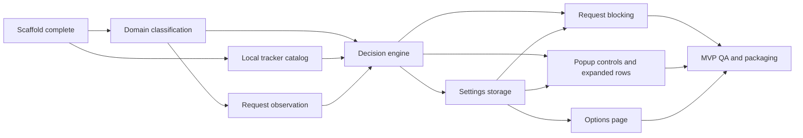

# Roadmap

This roadmap turns the MVP scope into a practical build order. It assumes the current scaffold is the baseline: WXT, Firefox MV3, Preact popup, Tailwind, background messaging, TypeScript, Vitest, and `web-ext` validation are already working.

## MVP

The MVP should become useful in three loops:

1. **Observe** third-party requests and show them in the popup.
2. **Explain** known third parties using packaged local catalog data.
3. **Control** behavior with local blocking, per-hostname overrides, and site pause.

Keep each loop shippable on its own. Avoid mixing blocking, catalog authoring, options UI, and popup polish in the same branch unless a small glue change demands it.

The first engineering slice should be **domain classification**, even though the first user-visible loop is request observation. Request observation immediately depends on a reliable answer to "is this request third-party relative to the current page?", so the classifier should land before the observer starts aggregating data.

### MVP Phase Diagram

The main concurrency window is early: domain classification and local catalog can proceed separately, and request observation can start once the classification contract is clear. Storage can begin after the decision types are sketched, then popup controls and options can split into separate worktrees.

### Guiding Constraints

- Firefox-first and MV3-first.
- Use WXT/Vite entrypoints instead of custom build glue.
- Keep tracker intelligence local and packaged.
- Use `browser.*` APIs.
- Store user settings and learned/local state only in `browser.storage.local`.
- Treat current-tab observations as short-lived background state unless the MVP explicitly needs persistence.
- Do not add telemetry, remote classification, accounts, sync, or runtime explanation fetches.

Firefox MV3 details worth keeping in mind:

- MV3 host access belongs in `host_permissions` or `optional_host_permissions`.
- Required request observation needs both the relevant API permission and matching host permissions.
- Firefox MV3 background pages are non-persistent, so register listeners at top level and persist important state to local storage.
- Useful references: [Firefox MV3 migration guide](https://extensionworkshop.com/documentation/develop/manifest-v3-migration-guide/) and [MDN permissions](https://developer.mozilla.org/en-US/docs/Mozilla/Add-ons/WebExtensions/manifest.json/permissions).

### Phase 1: Domain Classification

Goal: first-party vs third-party classification is correct enough to trust before request observation and blocking.

Purpose:

- Provide one shared answer to "is this request third-party relative to the current page?" before any observation, aggregation, catalog lookup, or blocking depends on it.
- Keep the classifier pure, framework-independent, and conservative so later request observation does not grow ad hoc URL parsing.
- Treat unclassifiable inputs as unknown for display and allowed for blocking decisions until a later phase deliberately says otherwise.

Work:

- Add a framework-independent domain module using `tldts`.
- Normalize domains and URLs defensively.
- Compare request domain against the page/site domain using public-suffix-aware parsing.
- Handle IPs, extension URLs, browser URLs, data URLs, missing URLs, and malformed URLs.
- Return structured outcomes for same-site, third-party, ignored/internal schemes, and unclassifiable inputs.
- Keep request type category mapping in Phase 2 with request observation, where the WebExtension event details are introduced.

Heuristics:

- Parse URLs with standard URL handling first, then use `tldts` for public-suffix-aware domain comparison.
- Normalize hostnames by trimming trailing dots, lowercasing, and avoiding path/query/string matching.
- Treat HTTP(S) and WebSocket request URLs as comparable web requests.
- Treat matching eTLD+1 domains as same-site, including subdomains such as `static.example.com` on `www.example.com`.
- Treat different eTLD+1 domains as third-party, including public suffix edge cases such as `example.co.uk` vs `other.co.uk`.
- Treat IP requests as same-site only when the normalized IP literals match exactly; different IPs are third-party.
- Treat extension, browser, `about:`, `data:`, and other non-web URLs as ignored or unclassifiable rather than as third parties.
- Treat missing or malformed inputs as unclassifiable; display them as unknown if surfaced, and do not block them by default.

Acceptance:

- Tests cover same-site, subdomain, cross-site, public suffix edge cases, IPs, and malformed inputs.
- The module exports a narrow API ready for request observation to consume.
- Roadmap/docs record the Phase 1 assumptions future observation and blocking code must preserve.

Suggested branch:

- `codex/domain-classification`

Worktree suitability:

- Can run in parallel with Phase 3 after agreeing on catalog/domain type names.
- Should merge before request observation and blocking work.

TODO: implementation details

- Exported API: `classifyRequestSiteRelationship()` returns structured same-site, third-party, ignored, or unclassifiable outcomes; `formatUrlHost()` provides safe host display for UI code.
- Key files: `src/shared/domains.ts`, `src/shared/domains.test.ts`, with popup display using the shared helper instead of local URL parsing.
- Test coverage: same host, subdomain same-site, cross-site, WebSocket requests, public suffix country-code domains, private suffix multi-tenant domains, IPs, localhost, normalization, non-web schemes, missing inputs, and malformed URLs.
- Assumptions: use platform `URL` parsing before `tldts`; compare registrable domains with private suffixes enabled; treat unclassifiable inputs as unknown for display and allowed by default for future blocking decisions.

### Phase 2: Request Observation

Goal: the popup shows real third-party hostnames observed on the active tab, without blocking anything yet.

Work:

- Add manifest permissions for request observation and host access.
- Define request evidence types: tab id, frame id, document URL, request URL, request type, timestamp, and blocked/allowed status.
- Define request type categories used by the popup.
- Add a background request observer using `browser.webRequest` listeners.
- Track top-level tab URL changes and clear or reset per-tab observations at sensible navigation boundaries.
- Aggregate requests by normalized third-party hostname for each tab using the Phase 1 classifier.
- Add a popup message to fetch the active tab's request summary.
- Replace the scaffold popup body with site status, summary counts, and a simple third-party list.

Acceptance:

- Visiting a site with third-party resources shows third-party hostnames in the popup.
- Refreshing or navigating does not mix old-page observations into the new page.
- Unknown third parties are shown as unknown, allowed, and not overclaimed.
- Unit tests cover aggregation and request evidence normalization.

Suggested branch:

- `codex/request-observation`

Worktree suitability:

- Good as a single focused worktree.
- Do not split request observation and popup summary until the background-to-popup message contract exists.

TODO: implementation details

- Permissions added: `webRequest` plus `<all_urls>` host permissions; no blocking permission or request cancellation.
- Listener strategy: `browser.webRequest.onBeforeRequest` records passive request evidence relative to the top-level tab page; `tabs.onUpdated` and `main_frame` requests reset tab state; `tabs.onRemoved` clears memory.
- Background state shape: short-lived in-memory tab summaries aggregate rows by normalized request hostname, relationship, request count, request types, and last-seen timestamp; registrable site domains are retained as metadata for classification/grouping.
- Popup message contract: `trackerblocker.getTabRequestSummary` returns active-tab counts and rows ordered as third-party, unknown/unclassifiable, then first-party; the popup refreshes while open.
- Test coverage: request type mapping, aggregation, ordering, top-level-page-relative frame requests, WebSocket requests, public-suffix-aware first-party handling, unknown/unclassifiable handling, resets, empty summaries, and message guards.

### Phase 3: Local Tracker Catalog

Goal: known third parties can be labeled and explained from packaged JSON.

Work:

- Define catalog schema: domain or suffix match, entity, category, default action, and explanation.
- Add a small initial catalog with representative entries across advertising, analytics, session replay, social, payment, security/fraud, CDN, and unknown fallback behavior.
- Add a lookup module that resolves the best matching catalog entry.
- Keep explanations one sentence and avoid claims stronger than the data supports.
- Validate packaged JSON shape in tests.

Acceptance:

- Known domains show category, entity, default action, and explanation.
- Unknown domains gracefully show the MVP unknown explanation.
- Tests cover exact matches, suffix matches, category mapping, and invalid catalog data.

Suggested branch:

- `codex/local-tracker-catalog`

Worktree suitability:

- Good parallel worktree after the catalog schema is agreed.
- Catalog data entry can proceed separately from UI styling.

TODO: implementation details

- Catalog data lives in `src/data/trackerCatalog.json` and is imported through `src/shared/trackerCatalog.ts`.
- Catalog entries include `id`, `matchType`, `domain`, `entity`, `category`, `defaultAction`, and one-sentence `explanation`.
- `lookupTrackerCatalogEntry()` normalizes domains, matches exact/suffix entries on label boundaries, and chooses the longest most-specific match.
- Seed data covers advertising, analytics, session replay, social, payment, security, and CDN examples, with block defaults only for tracking-oriented categories.
- `src/shared/trackerCatalog.test.ts` validates packaged data, malformed catalog rejection, suffix boundaries, exact matches, longest-match behavior, and cautious unknown fallback wording.
- Request observation enriches third-party rows with local catalog category, entity, explanation, and catalog default action; uncataloged third parties use the local unknown explanation.

### Phase 4: Decision Engine

Goal: every observed request has a clear decision and rule source.

Work:

- Define rule decision types: blocked, allowed, unknown, and allowed because site is paused.
- Define rule source types: automatic, blocked by user, allowed by user, and site paused.
- Apply precedence:
  1. Site pause.
  2. Per-domain user override.
  3. Catalog default action.
  4. Unknown third party allowed.
- Keep the decision engine pure and browser-independent.
- Feed decisions into popup summaries before enabling actual blocking.

Acceptance:

- Tests cover precedence, unknowns, catalog defaults, and paused-site behavior.
- Popup can show blocked/allowed/unknown counts from decisions, even before cancellation is enabled.

Suggested branch:

- `codex/rule-decisions`

Worktree suitability:

- Good focused pure-logic branch.
- Can proceed while storage design is being sketched once decision input types are clear.
- Should merge before actual request cancellation.

TODO: implementation details

- Decision logic lives in `src/shared/ruleDecisions.ts` and stays browser-independent.
- `decideRule()` returns `status`, `source`, and `shouldBlock` from relationship, catalog default action, optional hostname override, and optional site pause.
- Precedence is site pause, per-hostname block/allow override, first-party allow, unclassifiable/unknown visibility, catalog default, then unknown third-party allowed by default.
- Rule sources are `automatic`, `blocked-by-user`, `allowed-by-user`, and `site-paused`; statuses are `blocked`, `allowed`, `unknown`, and `allowed-paused`.
- Request observation now applies automatic decisions to row summaries before actual request cancellation exists.
- `src/shared/ruleDecisions.test.ts` covers precedence, catalog defaults, unknowns, and first-party behavior.

### Phase 5: Local Storage And Overrides

Goal: settings are stable before controls write to them.

Work:

- Define storage keys and schema versions.
- Implement storage accessors for site pauses and per-hostname overrides.
- Add migration hooks even if version 1 has no migration yet.
- Add reset helpers for settings.
- Add background message handlers for reading and updating settings.

Acceptance:

- Tests cover defaults, reads/writes, reset behavior, and schema validation.
- User settings live in `browser.storage.local`.
- No observed browsing data is persisted unless deliberately added.

Suggested branch:

- `codex/settings-storage`

Worktree suitability:

- Good focused worktree.
- Should merge before popup controls and options page.

TODO: implementation details

- Settings live under the `trackerblocker:settings` key in `browser.storage.local` with schema version `1`.
- `src/storage/settings.ts` stores only paused sites and per-hostname overrides; observed request summaries remain short-lived background memory.
- Storage accessors normalize settings, migrate unversioned local shapes, drop unknown future schema versions conservatively, and expose reset/update helpers.
- Background messages can read settings, update site pauses, set/reset hostname overrides, and reset local settings.
- Storage message failures return `trackerblocker.settingsErrorResponse` with `storage-unavailable` instead of hanging the popup/options request.
- `src/storage/settings.test.ts` and `src/messaging/settings.test.ts` cover defaults, normalization, migration, reads/writes, reset behavior, and message guards.

### Phase 6: Blocking

Goal: known blocking decisions cancel matching requests while preserving recovery paths.

Work:

- Add request cancellation for decisions that resolve to blocked.
- Ensure blocked attempts are still recorded for the popup.
- Ensure site pause and per-hostname allow override prevent cancellation.
- Be careful with listener registration: Firefox MV3 event pages need listeners registered at top level.
- Add manual test cases for broken-site recovery.

Acceptance:

- Known blocklisted third parties are canceled.
- Popup shows attempted blocked requests.
- Site pause allows all third parties for that site while still listing them.
- Per-domain allow overrides automatic blocking.
- Tests cover decision behavior; manual browser testing covers actual cancellation.

Suggested branch:

- `codex/request-blocking`

Worktree suitability:

- Keep this isolated. Blocking has the highest user-visible risk.
- Do not run concurrently with large changes to request observation.

TODO: implementation details

- `browser.webRequest.onBeforeRequest` now registers with `["blocking"]` and returns `{ cancel: true }` for rows whose local decision is `blocked`.
- The manifest includes `webRequestBlocking`; `npm run lint:firefox` validates the built Firefox MV3 output with zero errors and one bundled popup warning.
- Blocking decisions use an in-memory settings cache loaded from `browser.storage.local`, so the blocking listener stays synchronous while settings remain local.
- Blocked attempts are recorded through `recordObservedRequest()` before cancellation, so the popup summary includes attempted requests.
- Site pause and per-hostname allow override feed the same decision path and prevent cancellation.
- Request observation tests cover catalog-blocked rows, allow overrides, and site-pause recovery; manual Firefox checks remain part of Phase 9 QA.

### Phase 7: Popup Controls And Expanded Rows

Goal: the popup becomes the primary MVP surface described in `docs/mvp.md`.

Work:

- Add summary counts: total third parties, blocked, allowed, unknown.
- Add rows with hostname, request count, category, and status.
- Add expanded row details: entity, explanation, request types, rule source.
- Add Auto, Block, Allow controls per hostname.
- Add site pause toggle for the current site.
- Keep language careful: "third parties" by default, "likely" categories for catalog entries.

Acceptance:

- Controls update storage and immediately refresh decisions.
- Expanded rows explain known and unknown entries clearly.
- UI remains compact and readable in popup dimensions.
- Add Playwright smoke test if popup test harness is ready; otherwise keep manual QA notes.

Suggested branch:

- `codex/popup-controls`

Worktree suitability:

- Good worktree after Phases 4 and 5 merge.
- Visual work can proceed in parallel with options page once storage contracts are stable.

TODO: implementation details

- Popup UI remains in `src/entrypoints/popup/App.tsx` and uses the existing compact Preact/Tailwind structure.
- The default view shows current site, active/paused protection status, observed request total, and summary filters for third parties, blocked, allowed, and unknown rows.
- Rows expand in-place to show entity, local explanation, request types, rule source, and per-hostname Auto/Block/Allow controls for third-party rows.
- The site pause button writes through `trackerblocker.updateSitePause`; row controls write through `trackerblocker.setDomainOverride`, then refresh the summary from background state.
- Summary responses recompute row decisions from the current settings cache so controls update visible decisions immediately.
- Accessibility basics include real buttons, `aria-pressed` on filter/control buttons, and `aria-expanded` on expandable rows.
- No Playwright harness exists yet; Phase 7 verification used Vitest, TypeScript, and Firefox build, with manual browser smoke checks left for Phase 9.

### Phase 8: Options Page

Goal: users can review and reset local controls outside the popup.

Work:

- Add WXT options entrypoint.
- List paused sites with remove controls.
- List per-hostname overrides with reset-to-Auto controls.
- Add reset local settings control.
- State that settings and learned data stay on device.

Acceptance:

- Options page reads/writes the same storage accessors as popup controls.
- Reset controls work and are covered by tests where practical.
- UI remains small; no dashboard creep.

Suggested branch:

- `codex/options-page`

Worktree suitability:

- Good parallel worktree after storage schema merges.
- Avoid starting before storage keys and message contracts are stable.

TODO: implementation details

- The options page entrypoint lives in `src/entrypoints/options/` and WXT builds it as `options.html`.
- Options reads settings through `trackerblocker.getSettings` and uses the same background message handlers as the popup.
- Paused sites can be resumed, hostname overrides can be reset to Auto, and all local settings can be reset.
- Empty, loading, and storage-unavailable states are handled with compact inline UI.
- The page states that settings and learned data stay on device and that the MVP does not use telemetry, accounts, sync, remote classification, or runtime explanation fetches.
- Verification used Vitest, TypeScript, and Firefox build; options UI browser smoke checks remain part of Phase 9 QA.

### Phase 9: MVP QA And Packaging

Goal: make the MVP shippable enough for local dogfooding.

Work:

- Add manual QA checklist with representative sites.
- Run `npm run typecheck`, `npm test`, `npm run lint:firefox`, and `npm run zip:firefox`.
- Add Playwright smoke tests for popup/options if stable.
- Review permissions and install prompts.
- Review catalog wording for overclaiming.
- Update `docs/mvp.md` build status.

Acceptance:

- Fresh Firefox profile can run the extension.
- No runtime network explanations or telemetry.
- Known blockers block, unknowns are allowed and visible, and pause/override recovery works.

Suggested branch:

- `codex/mvp-qa`

Worktree suitability:

- Good final integration branch, not a feature branch.

TODO: implementation details

- QA notes live in `docs/qa.md`.
- Final verification ran `npm test`, `npm run typecheck`, `npm run lint:firefox`, and `npm run zip:firefox`.
- `web-ext run` installed the built `.output/firefox-mv3` extension as a temporary add-on in headless Firefox during a bounded runtime smoke.
- Firefox lint reports 0 errors, 0 notices, and 1 bundled-code `UNSAFE_VAR_ASSIGNMENT` warning; source search found no `innerHTML` or `dangerouslySetInnerHTML` usage.
- Zip output is available at `.output/trackerblocker-0.0.0-firefox.zip`; source zip is available at `.output/trackerblocker-0.0.0-sources.zip`.
- Manual browser checks for representative sites, pause recovery, overrides, options reset, and empty states are listed in `docs/qa.md`.

## Recommended Work Order

Use this order if working mostly solo:

1. `codex/domain-classification`
2. `codex/request-observation`
3. `codex/local-tracker-catalog`
4. `codex/rule-decisions`
5. `codex/settings-storage`
6. `codex/request-blocking`
7. `codex/popup-controls`
8. `codex/options-page`
9. `codex/mvp-qa`

Do not start request observation with throwaway URL parsing. It is tempting because it produces visible data sooner, but the observer's core job is to produce trustworthy third-party aggregates. Keep Phase 1 small, pure, and well-tested, then let Phase 2 use it directly.

## Concurrency Plan

Good concurrent work once contracts are agreed:

- Domain classification and local catalog.
- Catalog data entry and popup row design.
- Storage accessors and options page shell.
- Popup visual polish and Playwright smoke setup.
- Manual QA checklist and catalog wording review.

Avoid concurrent work in these areas:

- Request observation and request blocking.
- Storage schema and popup/options controls.
- Decision engine and blocking precedence.
- Manifest permissions and webRequest implementation.

When using multiple worktrees, keep each worktree on a branch that owns a narrow contract. Merge contract branches before feature branches that consume them.

## Suggested Commit Shape

Within each branch, aim for small commits:

1. Types and pure logic.
2. Browser integration.
3. UI integration.
4. Tests and docs.

For risky branches like blocking, prefer:

1. Decision plumbing without cancellation.
2. Cancellation behind tested rule decisions.
3. Popup visibility for blocked attempts.
4. Manual QA notes.

## MVP Definition Of Done

The MVP is done when:

- The extension observes current-tab third-party requests.
- The popup shows third-party hostnames, counts, categories, statuses, and explanations.
- Known block categories are blocked by default.
- Unknown third parties are allowed by default and shown clearly.
- Site pause and per-hostname overrides work.
- Options page can review and reset local controls.
- Settings stay in `browser.storage.local`.
- Catalog and explanations are packaged local data.
- Tests cover classification, catalog lookup, decision precedence, and storage.
- Firefox MV3 build, lint, and local run workflow are documented and passing.
