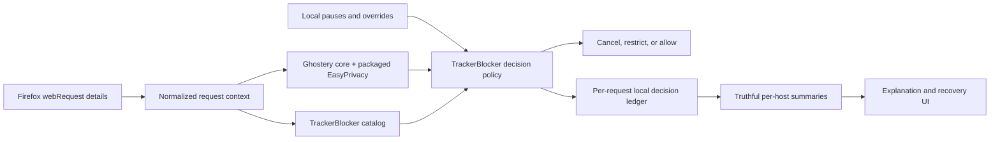

# EasyPrivacy Filtering Proposal

Status: accepted; Phases 0–5 completed on July 16–20, 2026

Reviewed against: `main` at `8772a27` on July 16, 2026, after fetching `origin` (`HEAD` and `origin/main` were equal)

Implementation checkpoint: Phases 0–4 were reconciled with the current code and
local verification results on July 20, 2026. Detailed evidence and remaining
manual browser gaps are recorded in [`docs/qa.md`](docs/qa.md).

Phase 0 result: **go to Phase 1**, subject to the conditions in
[`spikes/easyprivacy/RESULTS.md`](spikes/easyprivacy/RESULTS.md). The measured
compressed cost, cold initialization, synchronous matching, Firefox build, and
license review passed the initial gates without changing production behavior.

Phase 1 result: the exact upstream source, acquisition manifest, supported-only
engine, metadata, capability report, generation and verification scripts, and
third-party notices are versioned and packaged. Offline verification rebuilds
all generated bytes from source. Only `npm run update:easyprivacy` performs a
network request; production filtering behavior remains unchanged. See
[`docs/easyprivacy-updates.md`](docs/easyprivacy-updates.md) for the implemented
file layout and maintainer workflow.

Phase 2 result: production now validates and deserializes the packaged artifact
behind a browser-independent adapter, normalizes request contexts, produces one
request-level decision, and reuses that decision for cancellation and header
restriction. Engine health is explicit and all unavailable states fall back to
the catalog. At this checkpoint EasyPrivacy matching and enforcement were
disabled by default behind `WXT_EASYPRIVACY_MATCHING=true`.

Phase 3 result: listeners register synchronously, settings use a bounded
last-known-good startup gate, enforcement and evidence are request-level, and
badge and popup counts distinguish blocked requests from affected hosts.

Phase 4 result: local explanations retain bounded causal evidence, exact-site
hostname allows provide narrow recovery, global rules are advanced controls,
pause once survives worker restarts in session storage, and site-scoped policy
uses the authoritative top-level tab URL. Firefox 142 is the declared minimum.

Phase 5 result: the production corpus, Firefox 142/current local matrices,
worker/recovery exercise, paired 14-site study, performance/package budgets,
offline/privacy proof, and engineering licensing/source-archive inspection
pass. Supported subresource matching is default-on with an explicit
`WXT_EASYPRIVACY_MATCHING=false` emergency off value. Named
licensing/attribution sign-off remains a pre-release requirement before public
distribution; automatic `main_frame` enforcement remains deferred.

## Decision

Use the core [`@ghostery/adblocker`](https://github.com/ghostery/adblocker) package to evaluate packaged [EasyPrivacy](https://easylist.to/) network rules. Keep TrackerBlocker's existing catalog, decision policy, observations, explanations, and controls around that matcher.

This makes the product useful without trying to out-maintain uBlock Origin's filter engine or Privacy Badger's learning system. The differentiator should be a local, inspectable blocking ledger: TrackerBlocker should tell the user what request was acted on, which source caused the action, why it is associated with tracking, and how narrowly the user can recover a broken site.

EasyPrivacy must be generated and packaged during development or release. The installed extension must not fetch lists, classify requests remotely, send telemetry, or persist browsing history.

## Current Baseline

The repository already has more than a hard-coded domain check:

- `src/data/trackerCatalog.json` contains 82 entries: 76 block, 5 allow, and 1 restrict. It provides entity/category explanations and breakage risk for automatic block/restrict entries.
- `src/shared/trackerCatalog.ts` supports domain/suffix matching and optional path/URL rules, provenance, confidence, and breakage risk. The packaged JSON does not currently populate path rules or provenance.
- `src/shared/requestDecisions.ts` owns normalized request contexts, precedence,
  catalog evaluation, request-level evidence, header restriction, and the
  active-request decision cache.
- `src/shared/filterEngine.ts` is the only production Ghostery boundary. It
  validates the packaged metadata and artifact before matching.
- `src/entrypoints/background.ts` observes request lifecycle events, cancels blocked requests, strips `Cookie` and `Referer` for restricted requests, maintains per-tab evidence, and updates the badge.
- `src/shared/requestObservation.ts` records bounded frame, initiator, document, path, redirect, lifecycle, and visibility evidence in memory.
- The popup exposes per-host details, pause controls, site-scoped hostname
  recovery, and advanced global Auto/Block/Allow hostname overrides. Durable
  settings stay in `browser.storage.local`.
- The packaged extension loads the Phase 1 artifact and metadata from local
  `moz-extension:` URLs. It makes no remote filter-list request.

Request enforcement is request-level while popup rows aggregate immutable
action/source counts by host. Bounded representative attempts retain causal
EasyPrivacy, exception, catalog, request-type, and privacy-safe path evidence.
Listeners register synchronously, settings use a 500 ms cold gate with
last-known-good recovery, the badge counts blocked requests, and the popup
separately reports affected hosts. Remaining default-enablement work belongs to
the Phase 5 measurement and breakage gate.

## Target Architecture

Use `@ghostery/adblocker`, not its WebExtension convenience wrapper. TrackerBlocker should retain its own `browser.webRequest` listeners so that pause behavior, overrides, request evidence, header restriction, and explanations remain one coherent policy.

The filter adapter should be the only module that imports Ghostery types. It should accept a small, browser-independent request context and return a TrackerBlocker-owned result such as:

- no match;
- an EasyPrivacy blocking match;
- an EasyPrivacy exception;
- unavailable/degraded engine state.

Do not expose the rest of the codebase to the package's internal result shape. This keeps engine upgrades and a possible future replacement bounded.

The implementation does not package a runtime sidecar for unsupported rules.
Unsupported actions and syntax are inventoried globally in
`public/filter-data/easyprivacy.capabilities.json`, but the adapter
treat them as no-match because they are absent from the supported-only engine.
Add per-request unsupported-rule recognition only if later user-facing evidence
justifies the additional package and policy complexity.

### Automatic Decision Precedence

| Priority | Condition | Result |
| --- | --- | --- |
| 1 | Site is paused | Allow; record that pause caused it |
| 2 | User allowed the hostname on this exact site | Allow on this site |
| 3 | User globally blocked or allowed the hostname | Apply the global user choice |
| 4 | EasyPrivacy exception matches | Allow and stop automatic fallback evaluation |
| 5 | Supported EasyPrivacy network-block rule matches | Block |
| 6 | Existing catalog match applies | Block, restrict headers, or allow |
| 7 | No supported rule matches | Allow |

An EasyPrivacy exception must stop the catalog fallback; otherwise TrackerBlocker could re-block a request the list deliberately exempted. First-party requests remain allowed by default, but an explicit supported EasyPrivacy match may block them. The catalog should remain a third-party explanation/fallback source unless a future catalog entry deliberately defines different behavior.

User choices outrank automatic sources. Settings schema version 2 adds an
exact-site hostname allow, while global hostname rules remain available as an
explicit advanced choice.

The runtime does not automatically cancel `main_frame` navigations from an
EasyPrivacy match. An explicit user Block override may still cancel a
top-level navigation, while supported EasyPrivacy rules continue to apply to
subresources, including explicitly matched first-party subresources. Phase 5
owns the separate coverage, breakage, and recovery gate for deciding whether
automatic EasyPrivacy `main_frame` enforcement should be enabled.

### Data And Privacy Boundaries

- Package network-filter data with the extension. Do not enable cosmetic filtering, scriptlets, remote updates, or content injection in the first implementation.
- Generate a serialized engine artifact ahead of time instead of parsing the full text list on every background start.
- Commit metadata alongside the artifact: canonical source URL, retrieval time, upstream revision when available, source SHA-256, generator version, Ghostery package version, enabled capabilities, and rule counts.
- Run the networked update command only as an explicit maintainer action. Normal builds, tests, and extension runtime must work offline from committed inputs/artifacts.
- Keep request observations in background memory as they are today. Do not persist URLs, paths, or browsing history.
- Store durable user settings and site controls in `browser.storage.local`.
  Store tab-scoped pause-once state in `browser.storage.session`; keep request
  observations and browsing evidence only in bounded background memory.
- Verify EasyPrivacy attribution and redistribution requirements, plus Ghostery dependency notices, before shipping an artifact. This is a release gate, not an assumed legal conclusion.

## Implementation Phases

### Phase 0: Compatibility And Cost Spike

Completed on July 16, 2026. See
[`spikes/easyprivacy/RESULTS.md`](spikes/easyprivacy/RESULTS.md) for the pinned
inputs, supported capability report, measurements, and conditional go decision.

Goal: prove the chosen engine is safe to adopt before changing blocking behavior.

Work:

- Add `@ghostery/adblocker` on an isolated implementation branch and pin it through the lockfile.
- Compile a small synthetic EasyPrivacy-compatible fixture and the current EasyPrivacy network list.
- Verify block rules, exceptions, domain/source constraints, request-type modifiers, first-party path rules, and serialization/deserialization in the WXT Firefox build.
- Inventory rules that imply unsupported behavior such as redirects, response modification, CSP changes, HTML filtering, or parameter rewriting. Do not silently convert these into request cancellation.
- Measure the Firefox zip delta, cold engine initialization, serialized artifact size, and request-match latency.
- Review licenses and required notices.

Initial go/no-go targets, to be adjusted after measurements:

- less than 1.5 MB added to the compressed Firefox package;
- under 100 ms cold deserialization on the development baseline;
- under 1 ms p95 synchronous match time over representative request fixtures;
- no new runtime request, content-script, or storage permission;
- no runtime network access.

Exit gate: record measured results and supported rule capabilities. Stop if the package cannot meet Firefox packaging, license, or synchronous matching needs without expanding the product scope.

### Phase 1: Reproducible EasyPrivacy Supply Chain

Completed on July 17, 2026. See
[`docs/easyprivacy-updates.md`](docs/easyprivacy-updates.md) for operational
instructions and the current versioned file set.

Goal: make the packaged filter data reviewable and reproducible.

Implemented work:

- Added `npm run update:easyprivacy` as the only networked maintainer command.
- Retained the canonical assembled EasyPrivacy source, validated its provenance
  and content shape, and compiled only supported network blocks and exceptions.
- Generated a serialized engine, human-readable metadata, and a capability
  report containing excluded and unsupported-rule counts with bounded samples.
- Made offline generation byte-deterministic for the same retained source,
  acquisition manifest, generator, and Ghostery version.
- Added `npm run generate:easyprivacy` and `npm run verify:easyprivacy` for
  offline regeneration and byte-for-byte verification.
- Documented update review, recovery, attribution, packaging, and release checks
  in `docs/easyprivacy-updates.md`.

Exit gate: **met**. A reviewer can identify exactly which list bytes and engine
version produced the shipped artifact, and a normal build does not contact the
network for EasyPrivacy data.

### Phase 2: Filter Adapter And Unified Decision Model

Completed on July 17, 2026.

Goal: integrate the engine behind pure TrackerBlocker contracts with no default behavior change.

Implemented work:

- Add a `FilterEngine` adapter that loads the packaged artifact and maps normalized request details into Ghostery requests.
- Define one request-level `RequestDecision` containing action, source, matched exception/filter evidence, relationship, and optional header restriction.
- Refactor catalog lookup and `decideRule()` into the same policy path used by both `onBeforeRequest` and `onBeforeSendHeaders`.
- Cache the decision by request ID until completion/failure so later lifecycle listeners do not reclassify it inconsistently.
- Represent engine health as loading, ready, or degraded. If loading or failed, retain current catalog behavior and surface the degraded state; never enforce a partial engine.
- Put EasyPrivacy matching behind a local development/build flag until the accuracy phase passes.

Exit gate: **met**. Unit tests cover adapter validation and health, block and
exception evidence, precedence, loading/degraded fallback, request-ID reuse and
cleanup, and the unchanged catalog, pause, override, restriction, first-party,
and unknown-allow behavior while the flag is off. The default Firefox build
embeds the flag as disabled and retains the existing permissions and storage
schema.

### Phase 3: Request-Level Enforcement And Accurate Accounting

Completed on July 18, 2026.

Goal: enable EasyPrivacy without losing truthful evidence.

Work:

- Evaluate supported EasyPrivacy rules for HTTP(S) and WebSocket subresource contexts before the first-party default. Keep automatic EasyPrivacy `main_frame` cancellation disabled; explicit user Block overrides may still cancel top-level navigations.
- Honor exceptions and only cancel matches whose action is explicitly supported.
- Register WebExtension listeners synchronously at background startup. Load settings and the filter artifact behind explicit initialization state; use current catalog behavior while the EasyPrivacy engine is not ready.
- Change observation state from one merged hostname decision to per-request decision counts and bounded matched-rule samples.
- Aggregate for display only after enforcement. A host may show, for example, "3 of 9 requests blocked" instead of being labeled wholly blocked because one path matched.
- Define badge semantics explicitly. Recommended: badge text counts blocked requests; popup summary separately reports blocked hostnames. Use those exact labels.
- Preserve lifecycle accounting, redirect evidence, pause-once behavior, global overrides, and header restriction.

Implemented work:

- Listener registration completes before settings, filter-engine, or badge initialization begins.
- Settings wait at most 500 ms at cold startup. A last-known-good snapshot remains usable after later failures; without one, requests fail open with an explicit degraded decision source and later reads may recover the runtime.
- Each observed `onBeforeRequest` occurrence records an immutable action and source while redirect attempts retain the browser request ID and increment their attempt index. Later settings changes affect only future decisions; summaries overlay only the current override control.
- Active request decisions are reused by later listeners and removed on completion, failure, navigation, tab closure, age or capacity eviction, and worker restart. Missing or evicted decisions are not reclassified.
- Per-tab host rows, active decisions, redirect hops, context evidence, and matched rule/exception IDs are bounded. Exact request totals survive host-row truncation; affected host counts are labelled as lower bounds and all truncation states are exposed in the popup.
- Badge text counts blocked requests. Popup totals separately label blocked requests, blocked hosts, allowed requests, restricted requests, mixed hosts, and bounded evidence.
- Automatic EasyPrivacy enforcement defaults on and applies only to supported
  subresource matches, including supported first-party subresource matches. An
  explicit build-time false value disables it for emergency rollback.
  Automatic `main_frame` matching is not invoked; only an explicit user Block
  override can cancel top-level navigation.

Exit gate: **met**. A mixed-use hostname can contain blocked and allowed requests without either action being misreported. First-party subresources are blocked only by an explicit supported list rule or user choice, and `main_frame` navigations are blocked only by an explicit user choice.

### Phase 4: Explanation And Narrow Recovery UX

Completed on July 20, 2026.

Goal: turn mature filter coverage into TrackerBlocker's product advantage.

Work:

- Explain each automatic action with its source: EasyPrivacy, packaged catalog, or default allow.
- For EasyPrivacy matches, show a bounded normalized rule or stable rule identifier, request type, relevant path hint, and exception state. Do not require debug-mode list data if it materially inflates the package.
- Continue enriching matched hosts with catalog entity/category explanations when available. Do not invent an entity when the catalog has none.
- Show engine/list version and degraded state in a compact diagnostics area.
- Add "Allow on this site" as the primary recovery action, backed by a versioned local settings migration. Keep global Allow available as an explicit advanced choice.
- Make mixed host rows and blocked-request versus blocked-host counts visually unambiguous.

Implemented work:

- Each decision records a causal reason and EasyPrivacy evaluation state. Host
  rows retain immutable mixed action/source counts while on-demand details show
  up to six representative attempts, preferring exception, blocked, and
  restricted evidence under pressure.
- EasyPrivacy evidence uses artifact-scoped stable keys, bounded normalized
  summaries, request-type and party constraints, and compacted source-domain
  constraints without enabling Ghostery debug serialization.
- Request detail messages require the current tab observation generation and
  expose only hosts and scrubbed path hints, not query strings, full browsing
  URLs, or browser request IDs.
- Settings schema version 2 adds exact-site hostname allows and migrates version
  1 pauses/global overrides. Serialized mutations prevent lost updates.
- Pause-once state uses `browser.storage.session`, survives worker restarts, and
  clears at tab/navigation boundaries.
- Site-scoped decisions resolve the authoritative top-level tab URL after a
  worker restart and reject stale asynchronous tab lookups during navigation.
- The popup makes “Allow on this site” primary, moves global rules under an
  advanced disclosure, explains that changes affect future requests, and shows
  list/engine/settings/permission diagnostics. Options can remove scoped allows.
- Responsive checks at 380 px and 300 px found no horizontal overflow; mixed
  block/exception explanations and recovery feedback were exercised locally.

Exit gate: **met**. A user can answer “what was blocked, by which rule source,
why might it be tracking, and how can I fix only this site?” entirely from local
data.

### Phase 5: Coverage, Breakage, And Release Gate

Implementation status (July 20, 2026): the production corpus, Firefox
142/current local matrices, worker/recovery exercise, paired 14-site study,
performance/package budgets, and offline/privacy engineering inspection pass.
Supported EasyPrivacy subresource matching is default-on in the development
release candidate, with an explicit emergency-off value. Engineering licensing
and source-archive inspection is sufficient for this development stage; named
maintainer licensing/attribution sign-off is a required pre-release TODO before
public distribution. Automatic EasyPrivacy `main_frame` enforcement is
explicitly deferred. See
[`docs/easyprivacy-phase-5-evidence-2026-07-20.md`](docs/easyprivacy-phase-5-evidence-2026-07-20.md).

Goal: establish that the new coverage is materially better without unacceptable breakage.

Work:

- Build a local fixture corpus covering known block, exception, type-specific, source-site-specific, first-party path, redirect-chain, mixed-host, pause, and override cases.
- Evaluate automatic EasyPrivacy `main_frame` enforcement as a separate
  go/no-go decision. Test representative top-level matches and false positives,
  and enable it only if the coverage benefit justifies the higher breakage risk
  and Phase 4 recovery controls are adequate.
- Compare identical request fixtures, not badge numbers. Report blocked requests, blocked hosts, exceptions, unsupported rules, and false-positive regressions separately.
- Manually smoke-test representative news, commerce, login, video, payment, social, and quiet first-party sites in a fresh Firefox profile.
- Run `npm test`, `npm run typecheck`, `npm run lint:firefox`, and `npm run zip:firefox`.
- Confirm the built extension makes no runtime filter-list requests and stores no request evidence in `browser.storage.local`.
- Update `docs/qa.md`, `docs/testing.md`, and user-facing behavior documentation with measured results and recovery instructions.

Exit gate: enable EasyPrivacy by default only after coverage, package cost, startup/match performance, breakage recovery, license notices, and offline/privacy checks pass.

### Phase 6: Maintenance

Goal: keep coverage current without turning runtime updates into a privacy or reliability dependency.

Work:

- Update EasyPrivacy through reviewable maintainer pull requests on a defined cadence.
- Require metadata/checksum, capability report, size/performance checks, fixture tests, and attribution review for each update.
- Treat Ghostery engine upgrades separately from list refreshes when possible so regressions have one likely cause.
- Keep the prior generated artifact recoverable through version control. If a list update regresses breakage or performance, revert the artifact and metadata together.
- Review whether the local catalog should add entity/category context for frequently matched but unexplained hosts; do not duplicate thousands of EasyPrivacy rules into it.

## Implemented And Suggested File Boundaries

The implemented supply-chain boundaries are:

- `scripts/easyprivacy/update.mjs`: the only networked maintainer update command.
- `scripts/easyprivacy/generate.mjs`: offline artifact generation from retained source.
- `scripts/easyprivacy/verify.mjs`: offline provenance, byte-rebuild, deserialization, and representative-match verification.
- `scripts/easyprivacy/lib.mjs`: shared source validation, capability inventory, supported-only compilation, hashing, and deterministic output logic.
- `vendor/easyprivacy/`: exact upstream source and acquisition manifest.
- `public/filter-data/`: packaged serialized engine, metadata, and capability report.
- `public/THIRD-PARTY-NOTICES.txt`: attribution and license information included in the extension and Firefox source archive.

The runtime retains these responsibility boundaries:

- `src/shared/filterEngine.ts`: Ghostery adapter and engine health state.
- `src/shared/requestDecisions.ts`: unified, pure precedence and decision evidence.
- `src/shared/requestObservation.ts`: request ledger and host aggregation, without filter-engine imports.
- `src/entrypoints/background.ts`: WebExtension listener wiring and enforcement only.
- popup components: presentation and local recovery controls only.

## Main Risks And Recovery

| Risk | Mitigation | Recovery |
| --- | --- | --- |
| Filter artifact fails to load | Validate checksum/version and expose engine health | Continue current catalog behavior; do not enforce partial data |
| List rule causes breakage | Honor exceptions and add site-scoped allow | Pause the site or add a local scoped exception; revert bad list update if systemic |
| Engine/list update changes semantics | Separate adapter contract, pinned versions, fixture corpus | Revert engine or artifact independently |
| Package/startup cost is too high | Serialize ahead of time and enforce Phase 0 budgets | Keep the catalog blocker and reconsider a smaller compiled subset |
| Host aggregation hides mixed actions | Store request decisions before aggregation | Rebuild summaries from decision counts, not strongest host status |
| Unsupported rule action is misapplied | Capability inventory and explicit supported-action checks | Treat unsupported actions as non-enforceable and report them at generation time |
| Upstream or license requirements change | Record source/version/notices and review before release | Hold the update; continue shipping the last reviewed artifact |

## Definition Of Done

The integration is complete when TrackerBlocker uses packaged EasyPrivacy network rules through the Ghostery core matcher, preserves local-only privacy boundaries, accurately records each request decision, explains its rule source, offers site-scoped recovery, and has measured evidence that coverage improved without exceeding agreed size, performance, breakage, or licensing limits.
